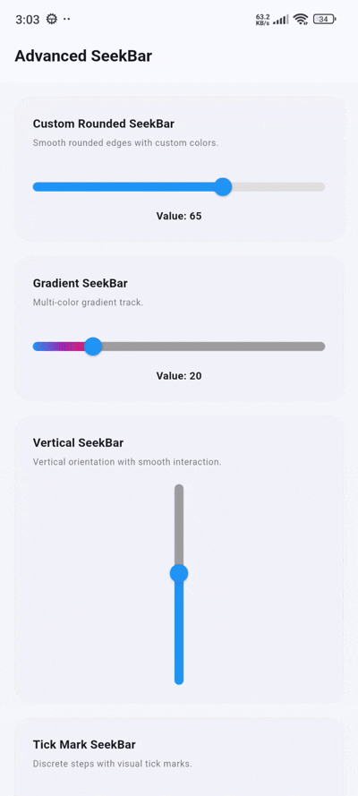

# flutter_advance_seekbar

[](https://flutter.dev)
[](https://opensource.org/licenses/MIT)
[](#)

**flutter_advance_seekbar** is a premium, highly customizable, and interactive seek bar and range slider widget library for Flutter. It features smooth rounded tracks, multi-color linear gradients, vertical & horizontal orientations, dynamic emoji and custom icon thumbs, discrete step tick marks, value indicator bubbles, dual-thumb range sliders, and native Right-to-Left (RTL) layout support.

---

## 📷 Preview

<p align="center">
  
</p>

*A premium interactive seek bar demonstration showing rounded tracks, multi-color gradients, vertical orientation, discrete tick marks, value indicator bubbles, range sliders, interactive emoji/icon thumbs, and RTL layout support.*

---

## ✨ Features

- **🎨 Multi-Color Gradients & Custom Rounded Tracks**
  - Customize track heights, rounded corner radii, active/inactive color properties, or apply multi-color `LinearGradient` fills across active tracks.
- **📐 Horizontal & Vertical Orientations**
  - Seamlessly switch between horizontal and vertical layouts using `SeekBarOrientation` or the `vertical: true` property flag.
- **😃 Interactive Emoji & Custom Icon Thumbs**
  - Dynamic emoji thumbs that change visually according to the current slider progress (e.g. 😠, 😐, 😊).
  - Customize thumb shapes using any Flutter Material `IconData` (`Icons.volume_up`, `Icons.star`, etc.) with full control over thumb size and icon font sizes.
- **📏 Discrete Steps & Tick Marks**
  - Define custom discrete step divisions and render custom tick mark shape painters along the track.
- **💬 Real-time Value Indicator Bubbles**
  - Display value indicator labels floating over thumbs while dragging.
- **↔️ Dual-Thumb Range Slider (`AdvancedRangeSeekBar`)**
  - Select range bounds using dual thumbs with support for value bubbles, custom track heights, and color overrides.
- **🔄 Native RTL (Right-to-Left) Support**
  - Native directionality support for right-to-left layout environments.
- **🚫 Disabled / Read-Only State**
  - Smoothly switch between interactive and read-only progress views with custom fallback disabled active/inactive colors.

---

## 📦 Installation

To use this library in your Flutter project, add `flutter_advance_seekbar` to your `pubspec.yaml` dependencies:

```yaml
dependencies:
  flutter:
    sdk: flutter
  # From pub.dev
  flutter_advance_seekbar: ^0.0.1
```

Or reference it directly from a Git repository:

```yaml
dependencies:
  flutter_advance_seekbar:
    git:
      url: https://github.com/your_username/flutter_advance_seekbar.git
      ref: main
```

---

## 🚀 Usage

Import the package in your Dart code:

```dart
import 'package:flutter_advance_seekbar/flutter_advance_seekbar.dart';
```

### 1. Simple Rounded SeekBar
Customize track height, colors, and border radius.

```dart
AdvancedSeekBar(
  value: _value,
  theme: AdvancedSeekBarTheme(
    activeColor: Colors.blue,
    inactiveColor: Colors.grey.shade300,
    trackHeight: 10,
    trackRadius: BorderRadius.circular(20),
  ),
  onChanged: (val) => setState(() => _value = val),
)
```

### 2. Multi-Color Gradient Track SeekBar
Apply a smooth multi-color linear gradient across the active track.

```dart
AdvancedSeekBar(
  value: _value,
  theme: const AdvancedSeekBarTheme(
    trackHeight: 10,
    gradient: LinearGradient(
      colors: [Colors.blue, Colors.purple, Colors.pink],
    ),
  ),
  onChanged: (val) => setState(() => _value = val),
)
```

### 3. Vertical Orientation SeekBar
Render vertical seek bars by setting `orientation` to `SeekBarOrientation.vertical` (or `vertical: true`).

```dart
SizedBox(
  height: 200,
  child: AdvancedSeekBar(
    value: _value,
    orientation: SeekBarOrientation.vertical,
    theme: const AdvancedSeekBarTheme(trackHeight: 10),
    onChanged: (val) => setState(() => _value = val),
  ),
)
```

### 4. Emoji Thumb SeekBar
Display dynamic reaction emojis that adjust based on the current slider value position.

```dart
AdvancedSeekBar(
  value: _value,
  emojiThumb: true,
  emojis: const ['😠', '😐', '😊'],
  theme: const AdvancedSeekBarTheme(trackHeight: 8),
  onChanged: (val) => setState(() => _value = val),
)
```

### 5. Custom Icon Thumb SeekBar
Replace standard slider thumbs with any Material Icon.

```dart
AdvancedSeekBar(
  value: _value,
  thumbIcon: Icons.volume_up,
  theme: const AdvancedSeekBarTheme(
    trackHeight: 8,
    thumbSize: 38,
    iconSize: 21,
  ),
  onChanged: (val) => setState(() => _value = val),
)
```

### 6. Discrete Divisions with Tick Marks & Value Bubbles
Show tick marks along step divisions and a floating value label above the thumb.

```dart
AdvancedSeekBar(
  value: _value,
  divisions: 10,
  showTicks: true,
  showValueBubble: true,
  theme: const AdvancedSeekBarTheme(trackHeight: 8),
  onChanged: (val) => setState(() => _value = val),
)
```

### 7. Dual-Thumb Range SeekBar (`AdvancedRangeSeekBar`)
Select range values using dual thumbs.

```dart
AdvancedRangeSeekBar(
  values: _rangeValues, // RangeValues(20, 80)
  min: 0,
  max: 100,
  showValueBubble: true,
  activeColor: Colors.blue,
  inactiveColor: Colors.grey.shade300,
  trackHeight: 8,
  onChanged: (newValues) => setState(() => _rangeValues = newValues),
)
```

### 8. Right-to-Left (RTL) SeekBar
Enable RTL directionality for internationalization support.

```dart
AdvancedSeekBar(
  value: _value,
  rtl: true,
  theme: const AdvancedSeekBarTheme(trackHeight: 8),
  onChanged: (val) => setState(() => _value = val),
)
```

---

## 🛠️ API Reference

### `AdvancedSeekBar` properties:

| Property | Type | Default | Description |
| :--- | :--- | :--- | :--- |
| `value` | `double` | *Required* | Current value of the seek bar slider. |
| `min` | `double` | `0.0` | Minimum selectable value. |
| `max` | `double` | `100.0` | Maximum selectable value. |
| `divisions` | `int?` | `null` | Discrete step count along the track. |
| `onChanged` | `ValueChanged<double>?` | `null` | Callback triggered while dragging or tapping. |
| `onChangeStart` | `ValueChanged<double>?` | `null` | Callback triggered when user starts dragging. |
| `onChangeEnd` | `ValueChanged<double>?` | `null` | Callback triggered when user finishes dragging. |
| `enabled` | `bool` | `true` | Enables or disables interaction. |
| `orientation` | `SeekBarOrientation` | `SeekBarOrientation.horizontal` | Sets horizontal or vertical orientation. |
| `vertical` | `bool` | `false` | Quick boolean flag for vertical orientation. |
| `rtl` | `bool` | `false` | Enables right-to-left layout direction. |
| `showValueBubble` | `bool` | `false` | Whether to display value bubble indicator above thumb. |
| `showTicks` | `bool` | `false` | Whether to display visual tick mark step painters. |
| `emojiThumb` | `bool` | `false` | Whether to use dynamic emoji thumb shapes. |
| `emojis` | `List<String>?` | `['😠', '😐', '😊']` | List of emojis mapped across the value range. |
| `thumbIcon` | `IconData?` | `null` | Material IconData to display inside thumb shape. |
| `theme` | `AdvancedSeekBarTheme` | `AdvancedSeekBarTheme()` | Theme styling properties for track & thumbs. |

### `AdvancedSeekBarTheme` properties:

| Property | Type | Default | Description |
| :--- | :--- | :--- | :--- |
| `activeColor` | `Color` | `Colors.blue` | Color of active track portion and thumb background. |
| `inactiveColor` | `Color` | `Colors.grey` | Color of inactive/unselected track portion. |
| `disabledColor` | `Color?` | `null` | Color override when `enabled: false`. |
| `trackHeight` | `double` | `6.0` | Height/thickness of the track. |
| `thumbRadius` | `double` | `10.0` | Radius of standard round thumb shape. |
| `thumbSize` | `double` | `36.0` | Size of custom icon/emoji thumb container. |
| `iconSize` | `double` | `20.0` | Font size of icon inside `thumbIcon`. |
| `trackRadius` | `BorderRadius` | `BorderRadius.circular(20)` | Outer corner radius of track ends. |
| `gradient` | `Gradient?` | `null` | Multi-color gradient fill for active track portion. |

### `AdvancedRangeSeekBar` properties:

| Property | Type | Default | Description |
| :--- | :--- | :--- | :--- |
| `values` | `RangeValues` | *Required* | Current range start & end values. |
| `min` | `double` | `0.0` | Minimum range value. |
| `max` | `double` | `100.0` | Maximum range value. |
| `divisions` | `int?` | `null` | Discrete step count for range selection. |
| `onChanged` | `ValueChanged<RangeValues>?` | `null` | Callback when start or end range values change. |
| `onChangeStart` | `ValueChanged<RangeValues>?` | `null` | Callback when range drag starts. |
| `onChangeEnd` | `ValueChanged<RangeValues>?` | `null` | Callback when range drag ends. |
| `enabled` | `bool` | `true` | Enables or disables interaction. |
| `rtl` | `bool` | `false` | Enables right-to-left layout direction. |
| `showValueBubble` | `bool` | `false` | Shows floating value bubbles for both range thumbs. |
| `activeColor` | `Color` | `Colors.blue` | Active range segment track color. |
| `inactiveColor` | `Color` | `Colors.grey` | Unselected outer track color. |
| `disabledActiveColor` | `Color?` | `null` | Active track color when disabled. |
| `disabledInactiveColor` | `Color?` | `null` | Inactive track color when disabled. |
| `trackHeight` | `double` | `6.0` | Height of the range track bar. |
| `thumbRadius` | `double` | `10.0` | Radius of range thumb shapes. |

---

## 📄 License

```lic
MIT License

Copyright (c) 2026 Excelsior Technologies

Permission is hereby granted, free of charge, to any person obtaining a copy
of this software and associated documentation files (the "Software"), to deal
in the Software without restriction, including without limitation the rights
to use, copy, modify, merge, publish, distribute, sublicense, and/or sell
copies of the Software, and to permit persons to whom the Software is
furnished to do so, subject to the following conditions:

The above copyright notice and this permission notice shall be included in all
copies or substantial portions of the Software.

THE SOFTWARE IS PROVIDED "AS IS", WITHOUT WARRANTY OF ANY KIND, EXPRESS OR
IMPLIED, INCLUDING BUT NOT LIMITED TO THE WARRANTIES OF MERCHANTABILITY,
FITNESS FOR A PARTICULAR PURPOSE AND NONINFRINGEMENT. IN NO EVENT SHALL THE
AUTHORS OR COPYRIGHT HOLDERS BE LIABLE FOR ANY CLAIM, DAMAGES OR OTHER
LIABILITY, WHETHER IN AN ACTION OF CONTRACT, TORT OR OTHERWISE, ARISING FROM,
OUT OF OR IN CONNECTION WITH THE SOFTWARE OR THE USE OR OTHER DEALINGS IN THE
SOFTWARE.
```
